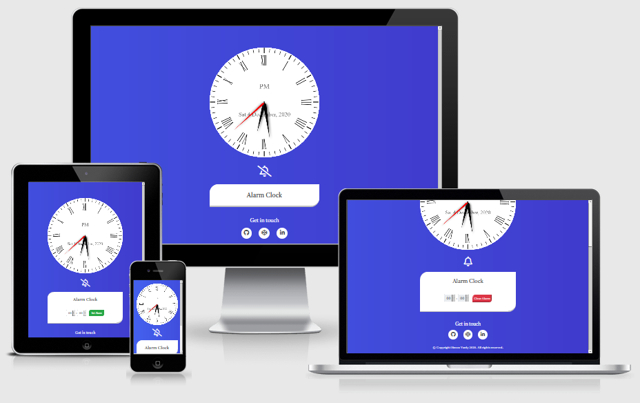
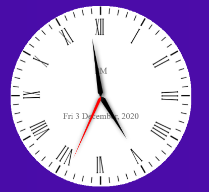
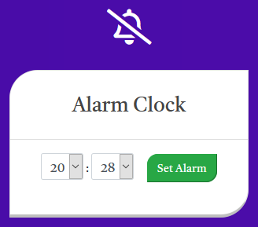
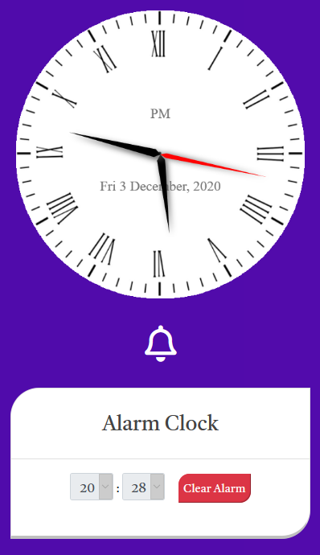
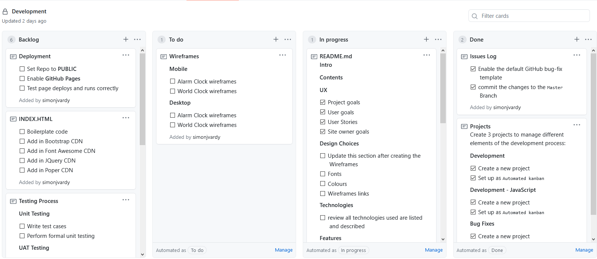

The idea for this project is to provide the user with an interactive alarm clock. 


The alarm clock features a running analogue clock face that shows the user's current time and date as well as providing a interactive alarm feature. Thje user is able to select a time for the alarm to go off and can set or cancel the alarm.


When the set alarm time is reached, the app plays an audible alarm as well as displaying visual indicator of the alarm.


 


## Contents ##

- [Contents](#contents)
- [UX (User Experience)](#ux-user-experience)
  - [Project Goals](#project-goals)
  - [User Goals](#user-goals)
  - [User Stories](#user-stories)
  - [Site Owner Goals](#site-owner-goals)
- [Design Choices](#design-choices)
  - [Fonts](#fonts)
  - [Colours](#colours)
  - [Wireframes](#wireframes)
    - [Hand drawn drafts](#hand-drawn-drafts)
    - [Final Wireframes](#final-wireframes)
- [Technologies](#technologies)
  - [Languages](#languages)
  - [Libraries](#libraries)
  - [Tools](#tools)
- [Features](#features)
  - [Features Implemented](#features-implemented)
  - [Responsive Design](#responsive-design)
  - [Interactive Elements](#interactive-elements)
  - [Future Features](#future-features)
  - [Site Construction](#site-construction)
  - [Page Layout](#page-layout)
  - [Construction Table](#construction-table)
  - [Clock](#clock)
  - [Drawing the Clock Hands](#drawing-the-clock-hands)
  - [Clock Face Text](#clock-face-text)
  - [Alarm](#alarm)
- [Project Management](#project-management)
- [Version Control](#version-control)
    - [Gitpod Workspaces](#gitpod-workspaces)
    - [Branches](#branches)
    - [Working within a branch](#working-within-a-branch)
    - [Merging branches in GitHub](#merging-branches-in-github)
    - [Update Gitpod with the latest GitHub commits](#update-gitpod-with-the-latest-github-commits)
- [Testing](#testing)
- [Bugs](#bugs)
- [Deployment](#deployment)
  - [Running alarm-clock Locally](#running-alarm-clock-locally)
- [Credits](#credits)
  - [Images](#images)
  - [Colour](#colour)
  - [Audio](#audio)
  - [Inspiration](#inspiration)
  - [Acknowledgements](#acknowledgements)


---

## UX (User Experience) ##

### Project Goals ###

The **goal** of this project is to build a a website that displays a running alarm clock. 


The **features** on the website will:

- Show a running analogue clock with the user's current local time.
- Provide an alarm clock feature that can be set for the user's local time.

I achieve this by:

- Building the clock functionality using an HTML5 `<canvas>` element to draw the clock face and hands.
- Allowing the user to **set an alarm time**, switch the alarm on or off with a combined alarm set / cancel button.

### User Goals ###

- **Show** the current local time.
- **Set** an alarm clock using the current local time.

### User Stories ###

- As a **user**, I want to see a running clock telling the current local time.
- As a **user**, I want to be able to see the times as AM or PM.
- As a **user**, I want to set an alarm clock.
- As a **user**, I want to hear an audible alarm sound and see a visual alarm cue at the set alarm time.
- As a **user**, I want to see social media links to contact the site owner.

### Site Owner Goals ###

- As a **site owner**, I want to create an **interactive website** to present a clean, easy to understand display of information.
- As a **site owner**, I want the **user** to their current local time and date.
- As a **site owner**, I want the **user** to be able to see errors displayed in a user friendly way.
- As a **site owner**, I want the **user** to be able to see or hear an alarm clock.

--- 

## Design Choices ##

### Fonts ###

I have chosen [Castoro](https://fonts.googleapis.com/css2?family=Castoro&display=swap) for all of the text.

### Colours ###

I have chosen the colours that blend and transition smoothly together. The animated background gradient colours give a rich, vibrant effect that allows the clock face, accordion and social media links to stand out.


- *Flickr Pink* (F72585) - Rich Pink
- *Byzantine* (B5179E) - Dark Pink
- *Purple* (7209B7) - Purple
- *Purple* (560BAD) - Purple
- *Trypan Blue* (480CA8) - Purple / Blue
- *Trypan Blue* (3A0CA3) - Purple / Blue
- *Persian Blue* (3F37C9) - Lighter Purple / Blue
- *Ultramarine Blue* (4361EE) - Mid Blue
- *Dodger Blue* (4895EF) - Blue
- *Vivid Sky Blue* (4CC9F0) - Sky Blue

These colours will compliment each other well when they transition from one colour to another to create a vivid but visually pleasing background.

### Wireframes ###

I designed the site mock-ups originally using pen and paper and then developing the designs further using [Balsamiq wireframes](https://balsamiq.com/).

I focussed on defining the basic layout structure of the site and identified how displays would change on different screen sizes such as mobile, tablet and desktop for each page.

#### Hand drawn drafts ####

The original hand drawn sketch wireframe was created as quick and rough method to try out page formatting ideas to form a basis for creating the wireframe within balsamic.

It represents the early stages of the design process for the website as ideas started to form and the flow of the design process from idea to finished website.
- [Homepage](wireframes/wireframe-mobile-homepage-draft.png)


#### Final Wireframes ####

The final wireframes were created using Balsamiq adapted from the original hand drawn wireframe concepts. The image shows the homepage from the site in three display sizes to demonstrate the page design and layout.

- [Homepage](wireframes/wireframes-homepage.png)

---  

## Technologies ##

### Languages ###

- [HTML5](https://developer.mozilla.org/en-US/docs/Web/HTML)
  - Used as the main markup language for the website content.
- [CSS3](https://developer.mozilla.org/en-US/docs/Web/CSS)
  - Used to style the individual webpages.
- [JavaScript](https://developer.mozilla.org/en-US/docs/Web/JavaScript)
  - Used to create the interactive functionality of the website

### Libraries ###

- [Bootstrap](https://getbootstrap.com/)
  - Used to design a mobile-first responsive website layout.
- [jQuery](https://jquery.com/)
  - Loaded as part of the [Bootstrap CDN starter template](https://getbootstrap.com/docs/4.5/getting-started/introduction/#starter-template)
- [Popper](https://popper.js.org/)
  - Loaded as part of the [Bootstrap CDN starter template](https://getbootstrap.com/docs/4.5/getting-started/introduction/#starter-template)


### Tools ###

- [Git](https://git-scm.com/)
  - Git was used for version control by utilizing the Gitpod terminal to commit to Git and push to GitHub.
- [GitHub](https://github.com/)
  - Used to store, host and deploy the project files and source code after being pushed from Git.
- [Gitpod](https://www.gitpod.io/)
  - An online IDE linked to the GitHub repository used for the majority of the code development.
- [CodePen](https://codepen.io/simonjvardy/)
  - An online code editor and open-source learning environment used to test small sections of code quickly and easily.
- [Visual Studio Code](https://code.visualstudio.com/)
  - A locally installed IDE connected to the GitHub repository for when there was no internet connection to use Gitpod.
- [Font-Awesome](https://fontawesome.com/icons?d=gallery)
  - Used for icons to enhance headings and add emphasis to text.
- [Google fonts](https://fonts.google.com/)
  - Used for the website fonts.
- [Coolors](https://coolors.co/)
  - An online tool used to choose the website colour scheme.
- [Favicons](https://favicon.io/)
  - Used to generate a favicon for the website title.
- [Am I Responsive?](http://ami.responsivedesign.is/)
  - A tool for taking a quick snapshot of the responsive breakpoints of the website to visualize how the site will look on different device screen sizes in one place. The resulting screenshot is also used as the README.md logo image.
- [What is my Screen Resolution](http://whatismyscreenresolution.net/)
  - An online tool to find out the screen resolution on your device used for CSS @media queries
- [CSS Gradient Animator](https://www.gradient-animator.com/)
  - An online tool to test and generate custom CSS for animated background colour gradient effects.
- [Online Audio Converter](https://online-audio-converter.com/)
  - An online tool to convert audio files between different file formats.
- [Adobe Photoshop CS4](https://en.wikipedia.org/wiki/Adobe_Photoshop)
  - A raster graphics editor used to manipulate the clock face background image.
  
---


## Features ##


### Features Implemented ###

### Responsive Design ###

 - Responsive mobile first design using a [Bootstrap](https://getbootstrap.com/) framework.
  - The site format was designed for **smaller** device sizes such as **mobile** and **tablet** devices to give a simple, user friendly display.
  - The clock face is displayed within a 500px x 500px **HTML5 canvas element** which responsively resizes and scales correctly for smaller display sizes.
  - The alarm setting are contained within an **accordion** to keep the layout clean and keep scrolling to a minimum on smaller display heights.
  - A **continuously transitioning** background colour to give a rich, vibrant, colourful display; creating contrast with the clock face and alarm settings.


### Interactive Elements ###

- The main features of the site are:
  - The **analogue** clock face displays:
    - The user's **current local time**
    - **AM / PM** indicator
    - The current **day, date, month** and **year**
  
      

  - A **bell icon** is used as a **visual cue** for the alarm state. 
    - A **bell icon** shows the alarm is **set** and with a **diagonal slash** to show the alarm is **not set**.
  
       

    - An additional feature of the **bell icon** is that the icon **"shakes"** when the alarm has triggered to assist with **accessibility**.
  - An alarm clock with time **selection** inputs for **hours** and **minutes** along with an **alarm set / cancel button**. 
    - The **alarm setting** are contained within an **accordion** to keep the layout clean and keep scrolling to a minimum on smaller display heights.
  
      

    - Once the alarm has been set, the hours and minutes selectors are **disabled** to prevent accidental changes to the set alarm time. They become **active** again when the alarm has been **cancelled**.

      

    - For ease of use, the alarm button toggles between a green **"Set Alarm"** button to a red **"Clear Alarm"** button when clicked.
    - When the alarm is triggered, an **audio file** is played which can be paused by clicking the red **"Clear Alarm"** button.

- Additional Site features:
  - A friendly HTTP 404 Error landing page for site visitors to see if a requested page is unavailable or cannot be accessed.
    - The page provides a button to click to return the visitor to the homepage.

      


### Future Features ###

- This small app has the potential to be expanded with **additional features**:
  - **Light / dark mode** selection button
  - Allow **multiple alarms** to be set and activated independently
  - use **Window localStorage Property** to save the set alarm time after the browser window closes.
  - Display **local weather** information from **APIs** such as OpenWeatherMap.org
  - Display **multiple clock faces** to allow users to show times for a city in a different timezone using **APIs** such as Google Time Zone.
  

### Site Construction  ###


### Page Layout ###
- Body
  - HTML canvas element with a height and width of 500px where the clock face background image and clock hands are drawn.
  - Alarm enabled / disabled icon is used as a visual indicator to show the alarm is either active or inactive.
  - A Bootstrap accordion single card that expands to reveal the alarm clock settings with selectors for alarm hours minutes and an alarm set / clear button.
  
    


### Construction Table ###


| Site Page | Page Section | JavaScript File |
| :---: | --- | :---: |
| Home | Canvas Element | clock.js |
| Home | Alarm accordion hours selector | alarm.js |
| Home | Alarm accordion minutes selector | alarm.js |
| Home | Alarm accordion button | alarm.js |
| Home | Bell icon | alarm.js |


### Clock ###


The [clock flowchart](wireframes/clock-flowchart.pdf) show the code logic for the clock function contained in the `clock.js` file.

- The clock is created and drawn on the **canvas** using the following:
  - An HTML5 `<canvas></canvas>` element using the `.getContext('2d')` method which contains all the **properties** that will be used to draw on the canvas; within the constraints of the canvas element **height and width**.
  - The **clock face** is a background image file cropped into a **circle**. This was done in **Photoshop CS4** as the original square image looked wrong in early development.
  - ***Note:*** Early testing showed that the clock canvas context method **failed** to draw anything if the background image **hadn't fully loaded**. This was **resolved** using a `.onload` **EventHandler property** setting a 100ms timeout to check whether the background image has loaded fully before calling the main `createClock()` function to draw the clock hands.
  - To **draw** each clock hand in the correct position:
    - The canvas is **rotated** about the **centre of the canvas** by a calculated angle corresponding to the current time value, drawing the hand before being returned back to the starting point again, ready to be rotated once more for the new time value.
    - The context `.rotate(Radians)` method is used to **rotate** the canvas and takes an angle in **Radians** as an argument. It was easier to imagine **rotation angles** in **degrees** instead of Radians so a small utility function is used to **convert** degrees to Radians by returning `(Math.PI / 180) * degrees` and passing this result as an argument in the `.rotate()` method.


### Drawing the Clock Hands ###

- Each **clock hand** has the same **basic shape** so a **common function** to draw the hand shape, with **hand dimensions** passed as **parameters**, is used which can be called when defining the hours, minutes and seconds hands.
- **Hours hand rotation calculation:**
  - The **formula** used to calculate the **hours rotation angle** is `(hours value * 360 / 12) % 360` so each hour rotates **30°**.
  - The `% 360` is really just a nice to have but not essential to the formula. The `Date()` object returns a time value in a **24hrs format**. The **modulus** just returns the same degrees value for **13-23 hours** as for **0-12** e.g. **03:00** or **15:00** returns **90°** rotation angle. Without the `% 360` **15:00** returns **450°** rotation angle which is the same end result.
  - With a **30°** angle between each hour on the clock face, the hour hand will make large jumps from hour to hour. To replicate a real clock hand movement, the **hour hand** rotation angle is **combined** with the **minutes value**: `hours value + (minutes value / 60)` to divide the movement between hours numbers into **1/60 segments**. As the minutes increase, the hour hand **slowly transitions** towards the next hour in **proportion** to the **minutes value**.

- **Minutes hand rotation calculation:**
  - The **formula** used to calculate the **minutes rotation angle** is `(minutes value * 360 / 60)` so each minute rotates **6°**.
  - As with the hours hand, the minutes hand needs to move smoothly so the **minute hand** rotation angle is **combined** with the **seconds value**: `minutes value + (seconds value / 60)` to divide the movement between minutes numbers into **1/60 segments**. As the seconds increase, the minute hand **slowly transitions** towards the next minute in **proportion** to the **seconds value**.

- **Seconds hand rotation calculation:**
  - The formula used to calculate the seconds rotation angle is `(seconds value * 360 / 60)` so each second rotates 6°. 
  - The seconds hand doesn't sweep but instead shows as a noticeable "ticking" hand; jumping from second to second, which I like.
  
- **Canvas Rotation:**
  - To draw the clock hands at the correct clock position, a hand is drawn after the canvas has been rotated about its central point.
  - Canvases normally rotate around the `0,0 (x,y)` coordinates, which is the top left corner of the canvas.
  - To rotate the clock hands, the rotation axis needs to be in the vertical and horizontal center of the canvas. For a 500px x 500px canvas this is at coordinates `250,250`. To move the centre point of the canvas, the context translate method is passed the canvas dimensions divided by two: `context.translate(canvas.width/2, canvas.height/2);`.
    - This has the added bonus of making the centre point responsive if the canvas dimensions are reduced from the defined dimensions on smaller device sizes.
  - The unfortunate downside to this approach is the background image is loaded from the new `0,0` coordinates in the centre of the canvas and now only covers the bottom right corner of the canvas!
    - To correct this, the canvas drawImage() method is passed the following arguments `context.drawImage(clockFaceImg, canvas.width/2 * -1, canvas.height/2 * -1, canvas.width, canvas.height);` to define the `HTMLImageElement`, starting x,y coordinates and the image width & height. This translates to `-250,-250` coordinates with the canvas width and height as `500px`.


### Clock Face Text ###
- The text is written to the canvas using the `context.fillText()` method.
- **AM / PM text:**
  - The AM / PM indicator is determined by getting the current time hours value, returned using the `getHours()` method of the `Date()` object, and applying the following conditional (ternary) operator `(hours >= 12 ? 'PM' : 'AM')` to see if the hours value is greater than 12 or not.

- **The date text:**
  - The year is returned using the `.getFullYear()` method of the `Date()` object.
  - The Month is returned using the `.getMonth()` method of the `Date()` object.
    - This is mapped to an array of month names where the `.getMonth()` value is passed as the array index to return the correct month name.
  - The date is returned using the `.getDate()` method of the `Date()` object.
  - The day is returned using the `.getDay()` method of the `Date()` object.
    - This is mapped to an array of days of the week names where the `.getDay()` value is passed as the array index to return the correct day of the week.


### Alarm ###


The [alarm flowchart](wireframes/alarm-flowchart.pdf) show the code logic for the alarm function contained in the `alarm.js` file.


- The **alarm function** gets the alarm hours and minutes values, the set / clear button clicks and the bell icon `<div>` element using the HTML DOM `document.getElementById()` method.


- The `alarmTime()` function gets the current time from a Date() object created with `new Date()`.
  - The current time is returned from the Date() object using the `.toLocaleTimeString()` method in the format "hh:mm:ss".
  - The set alarm time is compared to the current time every second. When there is equality in the string values, the audio file it triggered using the `.play()` method and the bell icon is assigned a new css class to make the icon "shake" using css animation.

- The alarm is set and cleared using the `.onclick` event for the alarm button
  - The function uses an `if else` conditional statement to determine the alarm state.


  - **Alarm Not Set**
    - When the alarm is not set, the user can select the alarm hours and minutes input selectors to the desired time values. 
    - The "bell-slash" icon is set using the `.innerHTML` property.
    - The alarm button background colour is set to green by assigning a css class using the HTML DOM `.getElementById().className` property
    - The alarm button text is changed to "Set Alarm" via the `innerHTML` property.

  - **Alarm Set**
    - When the alarm is set, the hours and minutes selectors are disabled using the `document.getElementById().disabled` property.
    - The alarm button background colour is set to red by assigning a css class using the HTML DOM `.getElementById().className` property
    - The alarm button text is changed to "Clear Alarm" via the `innerHTML` property.
    - The "bell-slash" icon is replaced with the "bell" icon via the `.innerHTML` property.
    - When the alarm is triggered, the bell icon has an additional css class assigned to make the image "shake" using the HTML DOM `.classList.add()` property.
      - This additional class is removed on button click to clear the alarm using the HTML DOM `.classList.remove()` property.

---

## Project Management ##

GitHub [Projects](https://github.com/simonjvardy/alarm-clock/projects) are used to organize the planning and development of the website.
Three GitHub projects are used to manage different aspects of the site development:
- [Development](https://github.com/simonjvardy/alarm-clock/projects/1)
  - Manages general project tasks and files including Documentation, HTML & CSS
- [Development - JavaScript](https://github.com/simonjvardy/alarm-clock/projects/2)
  - Manages tasks relating to the development of the JavaScript functionality
- [Bug Fixes](https://github.com/simonjvardy/alarm-clock/projects/3)
  - Manages the triage and prioritization of the bug fixes.

The Projects are created using the following GitHub templates:
- `Automated kanban` template for the **Development** and **Development - JavaScript** projects 
- `Bug Triage` template for the **Bug Fixes** project.

The following kanban project cards are used to manage the tasks:
- **Backlog** - this card is used to capture ideas for project tasks.
- **To Do** - this is the current work queue for the project.
- **In Progress** - this is the list of tasks currently in work.
    - New issues and pull requests are automatically added to this column using project card automation options.
- **Testing** - Testing tasks list
- **Done** - completed tasks

The following Bug Triage template project cards are used to manage the Bux fixes tasks:
- **Needs Triage** - this card is used to capture new bugs prior to assigning a priority.
  - A triage card is more appropriate for larger projects than this but left in as this is where all new issues are assigned when linking a project to a new issue.
- **High Priority** - this is the high priority queue for the project.
- **Low Priority** - this is the low priority queue for the project.
- **Closed** - completed tasks.

Markdown syntax is used to create **"To-Do" list** style checkboxes by adding `- [ ]` for an un-ticked checkbox and `- [x]` for a ticked checkbox on cards as a way of splitting a single complex task into a list of steps to be completed.




---

## Version Control ##
**Version control** for this repository is managed within **GitHub** and **Gitpod** using separate [branches](https://github.com/simonjvardy/alarm-clock/branches)  used to work on specific aspects of the project.
The following describes the repository branch structure:
- **Master** - this is the default branch and the source for the repository deployment.
    - **Documentation** - this branch is used for updating the README.md and testing.md documentation only.
    - **Development** - this branch is used as the main working branch for the website development
    - Each individual **bug fixes** are raised within their own **separate branches** using the naming convention **\<GitHub Issue ID Number>-\<bug fix description>** e.g. branch name ***12-correct-navbar-links*** 

The following workflow steps are used to create and update branches within Gitpod and to push changes back to GitHub.


#### Gitpod Workspaces ####
1. Open **Gitpod** from **Github** using the Gitpod button. This needs to only be done **once** at the start of the project.
2. Start the Gitpod Workspace which opens an **online IDE editor** window.


#### Branches ####
3. For changes to be made to any **documentation files**, the git command `git checkout documentation` is used to checkout and switch to the **documentation branch**.
4. For changes to be made to **other files** under normal site development, the git command `git checkout development` is used to checkout and switch to the **development branch**.
5. To create a **new branch** for bug fixes, use the git command `git checkout -b <branch-name>` to **create and switch** to the new branch.


#### Working within a branch ####
6. **New** or **modified** files are **staged** using the `git add .` command
7. The changes are **committed** using `git commit -m "<commit message>"` command.
8. If the changes are in a newly created branch, the **committed** changes are **pushed** from Gitpod to GitHub using the `git push --set-upstream origin <branch-name>` command as there is currently no upstream branch in the remote repository.
9. For branches that have already been synchronized, the **committed** changes are **pushed** from Gitpod to GitHub using the `git push` command.


#### Merging branches in GitHub ####
10. Opening the repository in Github, a new **pull request** is created for the updated branch and assigned to its related **Development**, **Development - JavaScript** or **Bug Fixes** project.
11. The changes are **reviewed** to ensure there are **no conflicts** between the **updated branch** and the **Master branch**.
12. The changes are then **merged** into the **Master branch** and the merge request is **closed**. The **Project entry** is **automatically** moved to the **Done** card.


#### Update Gitpod with the latest GitHub commits ####
13. To update Gitpod with the **latest commits** From GitHub, the `git checkout master` command is used to checkout and switch to the master branch.
14. Use the `git pull` command to update the master branch and **reset the pointer**.
15. Now **switch** to the **other branches** in Gitpod using the `git checkout <branch-name>` command and use the `git merge origin/master` command to **update each branch in turn**.
16. Use the `git push` on **each branch** to update the relevant GiHub Branches to the **same commit** as the **Master branch**.
17. **Repeat steps 3 - 17 regularly** to ensure updates are **saved** and **correctly version controlled** in GitHub.

---
## Testing ##

- Testing information can be found in a separate [testing.md](testing.md) file.

---
## Bugs ##

To manage bugs and issues tracking, the default GitHub [bug_report.md template](https://github.com/simonjvardy/alarm-clock/blob/master/.github/ISSUE_TEMPLATE/bug_report.md) has been created and activated within the repository settings Features > Issues section.
All new bugs and issues are tracked within the GitHub repository [Issues section](https://github.com/simonjvardy/alarm-clock/issues) .
Open issues are managed within the [GitHub Projects section](https://github.com/simonjvardy/alarm-clock/projects)

Each branch is then **merged** into the **master branch** using a **pull request** that is **linked** to the **open issue**. Once merged, and the bug report **closed**, the branch is **deleted**.

Fixed bugs and issues are marked as [closed](https://github.com/simonjvardy/alarm-clock/issues?q=is%3Aissue+is%3Aclosed).

---

## Deployment ##

The website was developed using both *Gitpod* and *Visual Studio Code* and using *Git* pushed to *GitHub*, which hosts the repository. I made the following steps to deploy the site using *GitHub Pages*:

- Opened up **GitHub** in the browser.
- Signed in with my **username** and **password**.
- Selected my **repositories**.
- Navigated to **simonjvardy/alarm-clock**.
- In the top navigation clicked **settings**.
- Scrolled down to the **GitHub Pages** area.
- Selected **Master Branch** from the **Source** dropdown menu.
- Clicked to **confirm** my **selection**.
- [alarm-clock](https://simonjvardy.github.io/alarm-clock/) is now **live** on **GitHub Pages**.

### Running alarm-clock Locally ###

Cloning alarm-clock from GitHub:

- Navigate to **simonjvardy/alarm-clock**.
- Click the **Code** button.
- **Copy** the url in the dropdown box.
- Using your favourite **IDE** open up your preferred terminal.
- **Navigate** to your desired file location.

Copy the following code and input it into your terminal to clone alarm-clock:

```git clone https://github.com/simonjvardy/alarm-clock.git```

---

## Credits ##

### Images ###

You can find the images used for the site [here](assets/images). I have sourced them through various websites, which are either free to use or used under license:

- Homepage
  - The [Clock Face Background Image](assets/img/clock-face-circle.png) was sourced from [DeviantArt](https://www.deviantart.com/agf81/art/Clock-Face-2-169291889) and licensed under CC BY 3.0 Credit: [AGF81](https://www.deviantart.com/agf81)

- 404
  - The [Error 404 Text Background Image](assets/img/bg.jpg) was sourced from [Colorlib](https://colorlib.com/wp/free-404-error-page-templates/) as part of a template licensed under CC BY 3.0

### Colour ###

- The colour palette was identified on [Coolors](https://coolors.co/)
- The CSS colour gradient animations were generated on [CSS Gradient Animator](https://www.gradient-animator.com/)


### Audio ###

- The [alarm clock audio file](assets/audio/) was sourced from the [BBC Sound Effects Library](http://bbcsfx.acropolis.org.uk/?q=alarm+clock) as a .wav file. However, the .wav file browser support is limited compared to .mp3 files. The .wav file was converted using [Online Audio Converter](https://online-audio-converter.com/) to create a .mp3 version.
  - The use of audio file is licensed under [The BBC's Content License for RemArc](https://github.com/bbcarchdev/Remarc/blob/master/doc/2016.09.27_RemArc_Content%20licence_Terms%20of%20Use_final.pdf)

### Inspiration ###

The following websites were used as the starting point and inspiration for creating the HTML Canvas clock code:
- [W3Schools](https://www.w3schools.com/graphics/canvas_clock.asp) Canvas Clock Tutorial.
- [dhtmlgoodies.com](http://www.dhtmlgoodies.com/tutorials/canvas-clock/) Excellent HTML Canvas clock tutorial
- [jQuery2DotNet](https://jsfiddle.net/lesson8/ezhzq/) HTML Canvas clock code example.
- [Script Tutorials](http://www.script-tutorials.com/html5-clocks/) HTML Canvas clock code example.
- [joylearn YouTube channel](https://www.youtube.com/watch?v=v3kDlRx0c5M) JavaScript alarm clock tutorial.
- [Code Instinct](https://www.youtube.com/watch?v=C2CrBlGvbEM) How to Create Realtime Clock using Html, CSS and Javascript
- [Anood @noodal Code Pen](https://codepen.io/noodal/pen/mddMWEO) Alarm clock in Vanilla Javascript.


### Acknowledgements ###

- [Simon Vardy](https://github.com/simonjvardy/Aviation-Consultancy) MS-1 Project for the re-use of many ideas and code snippets.
- [W3Schools](https://www.w3schools.com/) for just being a constant source of help and inspiration!
- [Code Institute](https://codeinstitute.net/full-stack-software-development-diploma/) Course material for the inspiration from code-along challenges.
- [San Francisco State University](https://its.sfsu.edu/projects/resources) PMO Resources webpage where the original Unit Testing and UAT Testing Plan documents were sourced
- [usersnap.com blog](https://usersnap.com/blog/user-acceptance-testing-example/) which was the inspiration for the modified UAT Testing document and wording.
- [Richard Read](https://github.com/Readri205/MS2_Project) for project inspiration and README.md format ideas.
- [Frozenaught](https://github.com/Frozenaught/homechopped) for further README.md content ideas.
- [Gary Simons](https://github.com/GarySimons/WildBunch-Florist) for further README.md content ideas.
- [Software Testing Fundamentals (STF)](http://softwaretestingfundamentals.com/) for an excellent guide on building testing processes.
- [Git - Branching and Merging](https://git-scm.com/book/en/v2/Git-Branching-Basic-Branching-and-Merging) documentation for help understanding how to manage branches in GitHub / Gitpod.
- [digitaljhelms](https://gist.github.com/digitaljhelms/4287848) for ideas and help with GitHub branch naming conventions.
- [TutorialRepublic](https://www.tutorialrepublic.com/twitter-bootstrap-tutorial/) for Boostrap help and tutorials.
- [Dev.Opera](http://dev.opera.com/articles/view/html-5-canvas-the-basics/) HTML5 canvas - the basics
- [rgraph](https://www.rgraph.net/canvas/reference/getcontext.html) The getContext() function tutorial.
- [Smashing Magazine](https://www.smashingmagazine.com/2010/10/local-storage-and-how-to-use-it/) Guide on Local Storage
- [GitHub](https://docs.github.com/en/free-pro-team@latest/github/working-with-github-pages/creating-a-custom-404-page-for-your-github-pages-site) Help guide on using Error 404 pages on repositories.
- [Colorlib](https://colorlib.com) the 404.html was made by Colorlib. Go visit their website for more awesome templates, themes and tools.
- [Jenkov.com](http://tutorials.jenkov.com/html5-canvas/text.html) tutorials on HTML5 Canvas.
- [kirkkenny](https://github.com/kirkkenney/alarm-clock) GitHub alarm-clock repo.
- [Stack Overflow](https://stackoverflow.com/) For help fixing so many thing that fell over on this project!
  - [Stack Overflow](https://stackoverflow.com/questions/273695/what-are-some-examples-of-commonly-used-practices-for-naming-git-branches) for ideas and help with GitHub branch naming conventions.
  - [Stack Overflow](https://stackoverflow.com/questions/18541331/how-to-make-javascript-use-time-from-the-alarm-clock-gmt-to-be-specific) for ideas and help with making JavaScript use the world clock (GMT).
  - [Stack OVerflow](https://stackoverflow.com/questions/25095548/how-to-draw-a-circle-in-html5-canvas-using-javascript) for ideas and help with drawing circles using HTML Canvas elements and JavaScript
  - [Stack Overflow](https://stackoverflow.com/questions/3511200/new-image-how-to-know-if-image-100-loaded-or-not) for fixing the "wait until the image has fully loaded" problem with the clock background.
- [Bootstrap](https://getbootstrap.com/)
  - [Modal](https://getbootstrap.com/docs/4.5/components/modal/) example code was copied and adapted for the Help Page.
  - [Form Groups](https://getbootstrap.com/docs/4.5/components/forms/) example code was copied and adapted for the alarm clock settings.
  - [Accordion](https://getbootstrap.com/docs/4.0/components/collapse/) example code was copied and adapted for the alarm clock settings.
  

---
